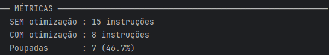

**Universidade do Minho**   
   
Licenciatura em Engenharia Informática \- LEI

**Processamento de Linguagens**

Projeto Final

**Grupo 23**

A107324 - David José Barbosa Alves  
A107368 - Diogo Malheiro Pais  
A106808 - Hugo Araújo Cunha

# **1\. Introdução** 

No âmbito da Unidade Curricular de Processamento de Linguagens, foi proposto o desenvolvimento de um compilador capaz de traduzir programas escritos em Fortran 77 (standard ANSI X3.9-1978) para a linguagem assembly da máquina virtual EWVM (European Web Virtual Machine).

A linguagem Fortran, sendo uma das linguagens de programação mais antigas ainda em uso, apresenta características sintáticas e estruturais peculiares, tais como o uso de labels numéricos para controlo de fluxo (como os ciclos DO e instruções GOTO), formatação rígida de colunas em código legado (comentários iniciados por 'C' na primeira coluna) e a indiferença a maiúsculas ou minúsculas (case-insensitivity). O desafio central deste projeto consistiu em capturar estas idiossincrasias e transformá-las numa representação intermédia coerente, que pudesse depois ser validada e convertida eficientemente em código máquina.

O compilador desenvolvido não só cumpre os requisitos mínimos estipulados — nomeadamente as fases de análise léxica, sintática, semântica e geração de código —, como também implementa os requisitos de valorização. Foram adicionados mecanismos de otimização de código operando sobre a Abstract Syntax Tree (AST) gerada, bem como suporte para subprogramas (FUNCTION e SUBROUTINE). Todo o projeto foi implementado em Python, recorrendo à biblioteca PLY (ply.lex e ply.yacc) para as fases de análise. Neste relatório, documentam-se as opções de desenho e implementação de cada fase do compilador, descrevem-se as estruturas intermédias utilizadas, as otimizações aplicadas, as dificuldades encontradas e, por fim, os testes realizados que validam a robustez da solução apresentada.

# **2\. Arquitetura do Compilador** 

A arquitetura do compilador desenvolvido segue uma estrutura clássica de processamento em fases sequenciais (pipeline), orquestrada pelo ponto de entrada principal (main.py). O processo de compilação divide-se nas seguintes etapas fundamentais:

* Pré-processamento e Análise Léxica: O código fonte é primeiramente limpo de comentários específicos da sintaxe Fortran e, de seguida, convertido numa sequência de tokens pelo analisador léxico.  
* Análise Sintática: A sequência de tokens é processada para validar a gramática do programa, gerando uma Árvore de Sintaxe Abstrata (AST) que representa a estrutura hierárquica do código.  
* Análise Semântica: A AST é percorrida para garantir a coerência do programa, validando a declaração de variáveis, consistência de labels (DO e GOTO) e chamadas de subprogramas.  
* Otimização de Código (Opcional): Se ativada, a AST sofre transformações para simplificar expressões e remover código inútil, aumentando a eficiência do programa resultante.  
* Geração de Código: Por fim, a AST otimizada é percorrida em duas passagens (uma para alocação de memória e outra para emissão de instruções) para gerar o código assembly final destinado à EWVM.


***Figura 1:** Arquitetura do Compilador EWVM.*

# **3\. Análise Léxica** 

A análise léxica foi implementada recorrendo à ferramenta ply.lex da biblioteca PLY (Python Lex-Yacc). Esta fase é responsável por ler os caracteres do ficheiro de entrada e agrupá-los em unidades lógicas (tokens) reconhecidas pela linguagem. Para lidar com as particularidades do Fortran 77, foram adotadas as seguintes estratégias de implementação no analisador léxico:

* **Pré-processamento de Comentários:** No Fortran 77 tradicional, as linhas que começam com a letra 'C' ou 'c' na primeira coluna são consideradas comentários. Foi criado um método preprocessar que percorre o código fonte e substitui estas linhas por linhas vazias (apenas com \\n). Esta abordagem permite descartar os comentários logo à partida, mantendo intacta a numeração original das linhas para apresentar mensagens de erro precisas.  
* **Case-insensitivity (Insensibilidade a Maiúsculas/Minúsculas):** Dado que o Fortran não distingue entre maiúsculas e minúsculas, o analisador léxico normaliza todos os identificadores (nomes de variáveis e palavras reservadas) convertendo-os para maiúsculas (função upper()) logo no momento do reconhecimento do token.  
* **Operadores Específicos:** Operadores relacionais e lógicos do Fortran contêm pontos em redor da palavra (ex: .TRUE., .AND., .EQ.). Estes foram definidos como funções (não como strings simples) para garantir prioridade absoluta sobre os identificadores comuns. O operador de exponenciação (\*\*) foi igualmente definido como função para ter prioridade sobre o operador de multiplicação (\*).  
* **Strings:** O tratamento de cadeias de caracteres acautelou a notação característica da linguagem, onde o escape de aspas simples dentro de uma string é feito duplicando as mesmas (ex: 'texto ''com'' aspas').  
* **Gestão Inteligente de Erros:** Em vez de emitir um erro por cada caractere inválido encontrado, o analisador acumula caracteres inválidos consecutivos. Desta forma, perante uma palavra ou símbolo totalmente desconhecido, o compilador emite apenas uma mensagem de erro consolidada, não sobrecarregando a consola do utilizador.

# **4\. Análise Sintática** 

A análise sintática foi desenvolvida com o módulo ply.yacc. O objetivo desta fase é receber a lista de tokens gerada pelo lexer, validar a estrutura gramatical do código Fortran 77 e construir uma Árvore de Sintaxe Abstrata (AST). No nosso compilador, a AST foi modelada de forma leve e eficiente utilizando tuplos e listas nativas do Python (ex: ('binop', '+', esq, dir) ou ('if', condicao, corpo)). Para garantir a correta construção da árvore e evitar ambiguidades matemáticas e lógicas, definimos explicitamente as regras de precedência e associatividade no parser:

1. Operadores lógicos (.OR., .AND.) têm a menor prioridade.  
2. Operação lógica de negação (.NOT.) avaliada à direita.  
3. Operadores relacionais (.EQ., .NE., .LT., etc.).  
4. Operadores aritméticos de soma e subtração (+, \-).  
5. Operadores aritméticos de multiplicação e divisão (\*, /).  
6. Operador de exponenciação (\*\*), associativo à direita (ex: 2\*\*3\*\*2 = 2\*\*(3\*\*2)).  
7. Menos unário (maior prioridade).

A AST construída captura todas as estruturas de controlo exigidas, como ciclos DO, instruções IF/THEN/ELSE, saltos GOTO e invocações de subprogramas (CALL e funções). Quando o ply.yacc deteta um erro sintático (por exemplo, a falta de um END ou um token inesperado), o compilador emite uma mensagem indicando a linha exata onde ocorreu a falha, auxiliando na depuração do código.

Para demonstrar a estrutura da nossa AST, considere-se a expressão Fortran X \= 2 \* 3 \+ 4\. O *parser* respeita a precedência da multiplicação sobre a adição e gera o seguinte tuplo em Python, que representa a árvore:

Tuplo Y \= ('assign', 'X', ('binop', '+', ('binop', '\*',  ('number', 2), ('number', 3)), ('number', 4)))  
  
***Figura 2:** Árvore Hierárquica do Tuplo Y.*

## **4.1 Gramática Implementada**

A gramática do compilador cobre as construções essenciais do Fortran 77. Apresentam-se abaixo as regras BNF principais:

```
compilation_unit ::= unit+
unit             ::= program | function | subroutine

program          ::= PROGRAM ID statements END
function         ::= type FUNCTION ID '(' param_list ')' statements END
subroutine       ::= SUBROUTINE ID '(' param_list ')' statements END

statements       ::= statement+
statement        ::= NUMBER statement                              (* label *)
                   | type id_list                                  (* declaração *)
                   | ID '=' expression                            (* atribuição *)
                   | ID '(' expression ')' '=' expression         (* atrib. array *)
                   | IF '(' expression ')' THEN statements ENDIF
                   | IF '(' expression ')' THEN statements ELSE statements ENDIF
                   | DO NUMBER ID '=' expression ',' expression
                   | DO NUMBER ID '=' expression ',' expression ',' expression
                   | GOTO NUMBER
                   | CONTINUE
                   | RETURN
                   | CALL ID '(' arg_list ')'
                   | PRINT '*' ',' print_list
                   | READ  '*' ',' ID
                   | READ  '*' ',' ID '(' expression ')'

expression       ::= expression ('+' | '-' | '*' | '/' | '**') expression
                   | expression ('.AND.' | '.OR.' | '.EQ.' | '.NE.'
                               | '.LT.' | '.LE.' | '.GT.' | '.GE.') expression
                   | '.NOT.' expression
                   | '-' expression                               (* unário *)
                   | '(' expression ')'
                   | NUMBER | REAL_NUMBER | ID
                   | '.TRUE.' | '.FALSE.'
                   | ID '(' arg_list ')'                          (* chamada função *)
                   | MOD '(' expression ',' expression ')'
                   | SQRT '(' expression ')'
                   | ABS '(' expression ')'

type             ::= INTEGER | REAL | LOGICAL
```

# **5\. Análise Semântica** 

Com a AST construída e a estrutura gramatical validada, o compilador avança para a análise semântica (semantic.py). Esta fase não altera a AST, mas percorre-a recursivamente (utilizando o padrão Visitor) para validar a coerência do programa e as regras de contexto da linguagem. O analisador semântico implementado verifica diversas regras cruciais para a linguagem Fortran 77:

* **Declaração Prévia de Variáveis:** O compilador mantém uma tabela de símbolos (symbol table) local a cada subprograma. Sempre que uma variável ou um array é utilizado numa expressão, numa atribuição, ou numa operação de leitura (READ), verifica-se se a mesma foi previamente declarada.  
* **Validação de Subprogramas:** As funções e subrotinas são registadas numa primeira passagem. Durante o processamento do código, sempre que ocorre uma invocação (CALL ou chamada de função), o compilador valida se o subprograma existe e se o número de argumentos fornecidos corresponde exatamente ao número de parâmetros esperados.  
* **Consistência de Labels e Ciclos DO:** Um dos grandes desafios do Fortran 77 é o controlo de fluxo baseado em labels numéricos. O nosso analisador regista todos os labels esperados por instruções DO e GOTO. No final da análise de cada bloco, verifica se todos os GOTO apontam para um label existente e se todos os ciclos DO encontram o respetivo CONTINUE com o label correto de fecho.

Esta validação estrita impede que programas com inconsistências lógicas cheguem à fase de geração de código, garantindo a robustez da solução final.

# **6\. Otimização de Código (Fase de Valorização)** 

Para cumprir a etapa de valorização proposta no guião do projeto, o compilador inclui um módulo otimizador (otimizador.py) que atua diretamente sobre a Árvore de Sintaxe Abstrata (AST) antes da geração do código *assembly*. O objetivo desta fase é reduzir a quantidade de instruções executadas pela máquina virtual, tornando o código final mais eficiente. As otimizações implementadas enquadram-se nas seguintes categorias:

* **Constant Folding:** O compilador deteta operações aritméticas ou lógicas cujos operandos são valores constantes (ex: 2 \* 3 \+ 4\) e resolve-as em tempo de compilação. Desta forma, expressões complexas são substituídas pelo seu resultado final na AST, evitando o cálculo repetitivo em tempo de execução. Esta otimização estende-se também à exponenciação (ex: 2\*\*8 → 256) e às funções intrínsecas SQRT e ABS aplicadas a constantes.  
* **Simplificação Algébrica:** Foram introduzidas regras algébricas para eliminar operações redundantes. Por exemplo, somar zero (X \+ 0), multiplicar por um (X \* 1\) ou multiplicar por zero (X \* 0\) são operações detetadas e simplificadas automaticamente.  
* **Eliminação de Código Inalcançável (Static IF):** Em blocos condicionais cuja condição pode ser avaliada estaticamente (por exemplo, IF (.FALSE.)), o otimizador remove o bloco de código por inteiro, uma vez que este nunca será executado.  
* **Leis de De Morgan e Negação:** Otimizações ao nível da lógica booleana, como a dupla negação (.NOT. (.NOT. X) \-\> X) ou a inversão de operadores relacionais em blocos negados (transformar .NOT. (A .EQ. B) diretamente em A .NE. B), reduzindo o número de instruções na máquina virtual.
* **Unrolling de Exponenciação:** Para expoentes constantes pequenos (≤ 8), a expressão X\*\*N é expandida em N multiplicações consecutivas na AST, evitando o custo de um ciclo em tempo de execução.

**Demonstração de Otimização (Antes e Depois):** Para ilustrar o impacto do otimizador (otimizador.py), vejamos o caso de uma simplificação algébrica combinada com *constant folding*. Na expressão original Y \= X \+ (2 \* 0), a AST sofre as seguintes transformações:

**AST Original (Antes da Otimização):**

('assign', 'Y', ('binop', '+', ('id', 'X'), ('binop', '\*',  ('number', 2), ('number', 0)) ))

**AST Otimizada (Depois da Otimização):**

('assign', 'Y',  ('id', 'X'))

***Explicação:*** O otimizador deteta primeiro que 2 \* 0 resulta em 0 (*constant folding*) e, de seguida, percebe que X \+ 0 é simplesmente X (simplificação algébrica). Assim, reduz uma árvore com múltiplas operações matemáticas a uma simples atribuição direta.


***Figura 3:** Otimização da Árvore.*

# **7\. Geração de Código** 

A última fase do compilador (codegen.py) é responsável por converter a AST validada (e opcionalmente otimizada) nas instruções específicas da máquina virtual EWVM. Para lidar com a gestão de memória e a emissão das instruções de forma estruturada, o processo foi dividido em duas passagens independentes:

1. **Passagem de Alocação de Memória (*Scan*):** A AST é percorrida primeiramente para identificar todas as variáveis declaradas (locais ou globais) e parâmetros de funções. A cada variável é atribuído um endereço único global. No caso de *arrays*, é contabilizado o seu tamanho total para posterior alocação contígua.  
2. **Passagem de Geração (*Emit*):** Na segunda iteração, o compilador emite o código EWVM correspondente. As variáveis escalares são manipuladas com instruções pushg e storeg, enquanto os *arrays* são alocados na *heap* utilizando a instrução alloc combinada com cálculos de *offset* estáticos.

Um dos aspetos mais interessantes implementados na geração de código foi a deteção heurística do padrão WHILE. Em Fortran 77, os ciclos condicionais são muitas vezes expressos combinando rótulos numéricos, instruções IF e GOTO. O nosso gerador reconhece o padrão N IF (cond) THEN ... GOTO N ENDIF na AST e converte-o de forma elegante num ciclo estruturado em assembly (recorrendo a jz e jump), evitando assim saltos desnecessários e mantendo o código gerado limpo e previsível.

**Demonstração da Deteção do Padrão WHILE:** Considere-se o seguinte excerto de código Fortran, que emula um ciclo *while* usando *labels* e *gotos*:

```fortran
20 IF (QUOT .GT. 0) THEN
      QUOT = QUOT / 2
      GOTO 20
   ENDIF
```

O nosso gerador de código deteta que o GOTO 20 é a última instrução dentro do bloco do IF que partilha o mesmo *label* (20). Em vez de gerar *labels* avulsos e emaranhados, o compilador emite o seguinte código EWVM estruturado:

```
L20:
  pushg 0          // Carrega variável QUOT
  pushi 0          // Carrega o número 0
  sup              // Verifica se é maior (.GT.)
  jz L21           // Se for falso (0), salta para o fim do bloco (L21)
  // [Corpo do ciclo: QUOT = QUOT / 2]
  pushg 0
  pushi 2
  div
  storeg 0
  jump L20         // Salta estruturadamente de volta para o início do ciclo
L21:
```

Sem esta otimização, o mesmo padrão geraria um label solto L20: no meio do código e um jump L20 explícito que tornaria o fluxo difícil de seguir. A deteção do padrão elimina esse jump redundante e produz um ciclo com estrutura clara de entrada, corpo e saída.

# **8\. Testes e Resultados** 

Para validar a corretude e a eficiência do nosso compilador, foi desenvolvida uma suíte de testes automáticos (testes.py). Esta ferramenta lê ficheiros Fortran de exemplo (.f), compila o código duas vezes (com e sem otimização) e compara o número de instruções *assembly* geradas, produzindo métricas de poupança por programa.

## **8.1 Resultados por Exemplo**

A tabela seguinte resume os resultados obtidos para os cinco exemplos do enunciado e para os testes de otimização isolados:

| Teste | Descrição | Instr. SEM opt. | Instr. COM opt. | Poupança |
|-------|-----------|:--------------:|:--------------:|:--------:|
| Exemplo 1 | Olá Mundo | 4 | 4 | 0% |
| Exemplo 2 | Fatorial (DO loop) | 35 | 35 | 0% |
| Exemplo 3 | Número primo (WHILE pattern) | 67 | 67 | 0% |
| Exemplo 4 | Soma de array | 46 | 46 | 0% |
| Exemplo 5 | Conversor de bases (função) | 101 | 101 | 0% |
| Teste 6 | Constant Folding (2\*3+4) | 20 | 14 | **30%** |
| Teste 7 | IF estático (.FALSE.) | 13 | 7 | **46%** |

Os exemplos 1–5 não apresentam poupança de instruções porque não contêm expressões com constantes literais nem condições avaliáveis estaticamente — são programas realistas que dependem de valores lidos em tempo de execução. As otimizações atuam especificamente em expressões constantes e condições booleanas estáticas, que aparecem tipicamente em código de configuração ou inicialização.

## **8.2 Teste do IF Estático**

Este teste demonstra a eliminação de código inalcançável. Como a condição do IF é avaliada estaticamente como .FALSE. logo durante a compilação, o otimizador remove o bloco por completo. Isto evita a geração de instruções mortas e de saltos condicionais (jz) desnecessários na máquina virtual.


***Figura 4:** Teste do IF estático.*

***Figura 5:** Métricas do teste feito na figura 4.*

## **8.3 Teste do Constant Folding**

Este teste ilustra a atuação do *Constant Folding*, que resolve operações entre literais (ex: 2 \* 3 \+ 4\) na própria AST. Na versão otimizada, as múltiplas instruções matemáticas geradas (pushi, mul, add) são substituídas por uma única instrução contendo o resultado final já calculado — uma redução de 30% no número de instruções para este programa.


***Figura 6:** Teste Constant Folding.*

***Figura 7:** Métricas do teste feito na figura 6.*

# **9\. Limitações Conhecidas**

Embora o compilador cumpra os requisitos propostos e inclua mecanismos de otimização, a enorme abrangência do standard do Fortran 77 resulta em algumas limitações nesta versão:

* **Tipos de Dados Avançados:** Não existe suporte para os tipos `DOUBLE PRECISION`, `COMPLEX` e `CHARACTER`. Programas que os utilizem não serão compilados corretamente.
* **Arrays Multidimensionais:** A implementação suporta apenas arrays unidimensionais (ex: `INTEGER A(10)`). Declarações como `REAL M(3,3)` não são reconhecidas pela gramática.
* **Passagem de Arrays a Subprogramas:** O compilador não suporta a passagem de arrays inteiros como argumentos a funções ou subrotinas. Apenas variáveis escalares podem ser passadas por parâmetro.
* **Instrução WRITE Formatada:** Apenas o `PRINT *` (formato livre) é suportado. A instrução `WRITE` com especificação de formato (ex: `WRITE(6,'(I5)') N`) não foi implementada.
* **Exponenciação Geral:** O operador `**` com expoentes variáveis (ex: `X**N` onde N é lido em tempo de execução) emite uma instrução de aviso mas não computa o resultado correto. O suporte completo está limitado a expoentes constantes até 8 (unrolling) ou a avaliação em compile-time pelo otimizador.
* **Funções Intrínsecas Limitadas:** Apenas `MOD`, `SQRT` e `ABS` estão implementadas. Funções como `SIN`, `COS`, `EXP`, `LOG` e `INT` não estão disponíveis.

# **10\. Conclusão**

O desenvolvimento deste compilador de Fortran 77 revelou-se um desafio extremamente enriquecedor e multidisciplinar. Para além de consolidar os conceitos lecionados sobre análise léxica, sintática e semântica, obrigou o grupo a lidar com construções legacy e paradigmas antigos de programação. O resultado é um sistema funcional, modular e otimizado que cumpre plenamente os requisitos iniciais e estende a sua utilidade com a implementação dos níveis de valorização exigidos.